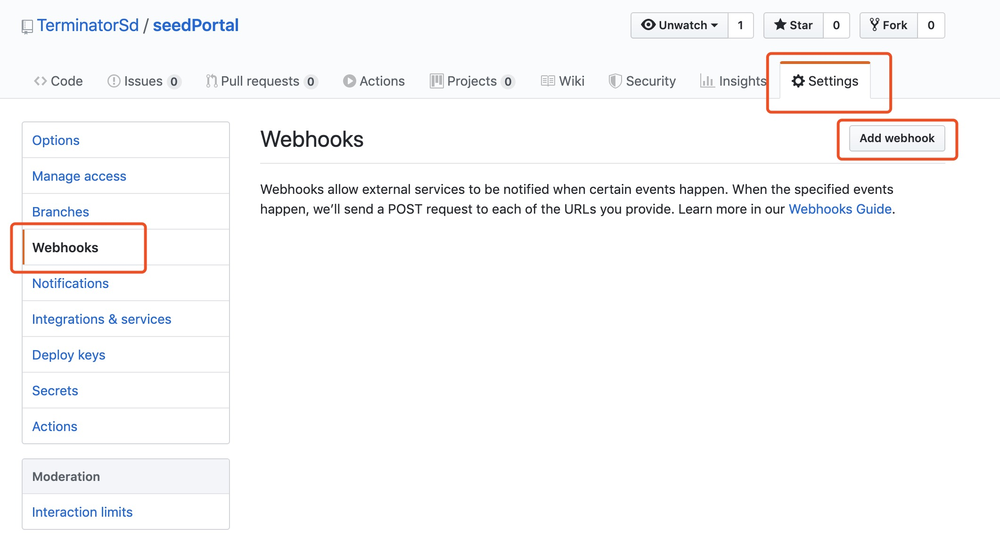
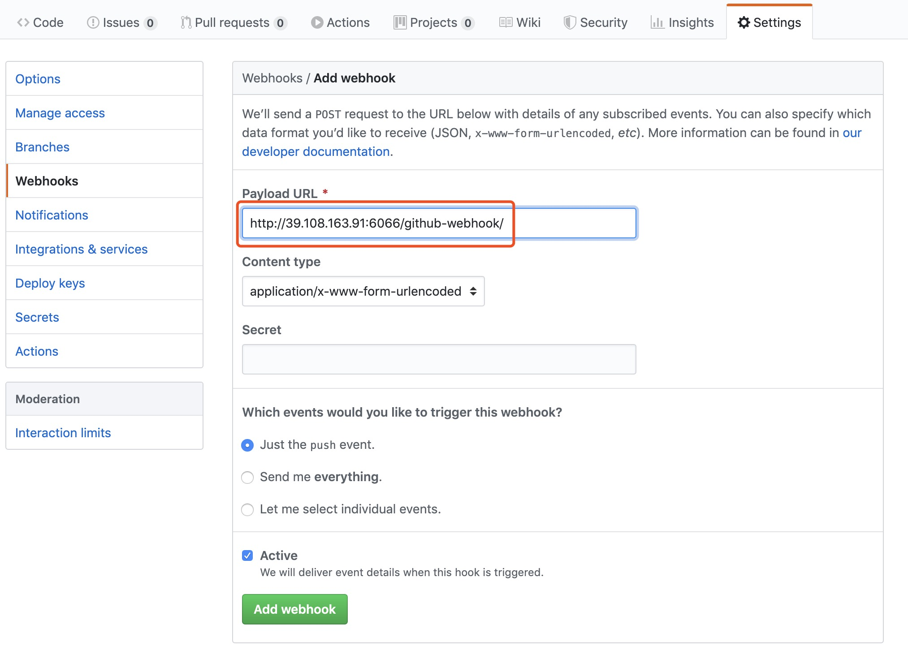
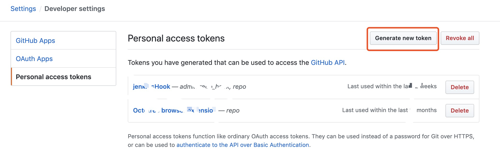
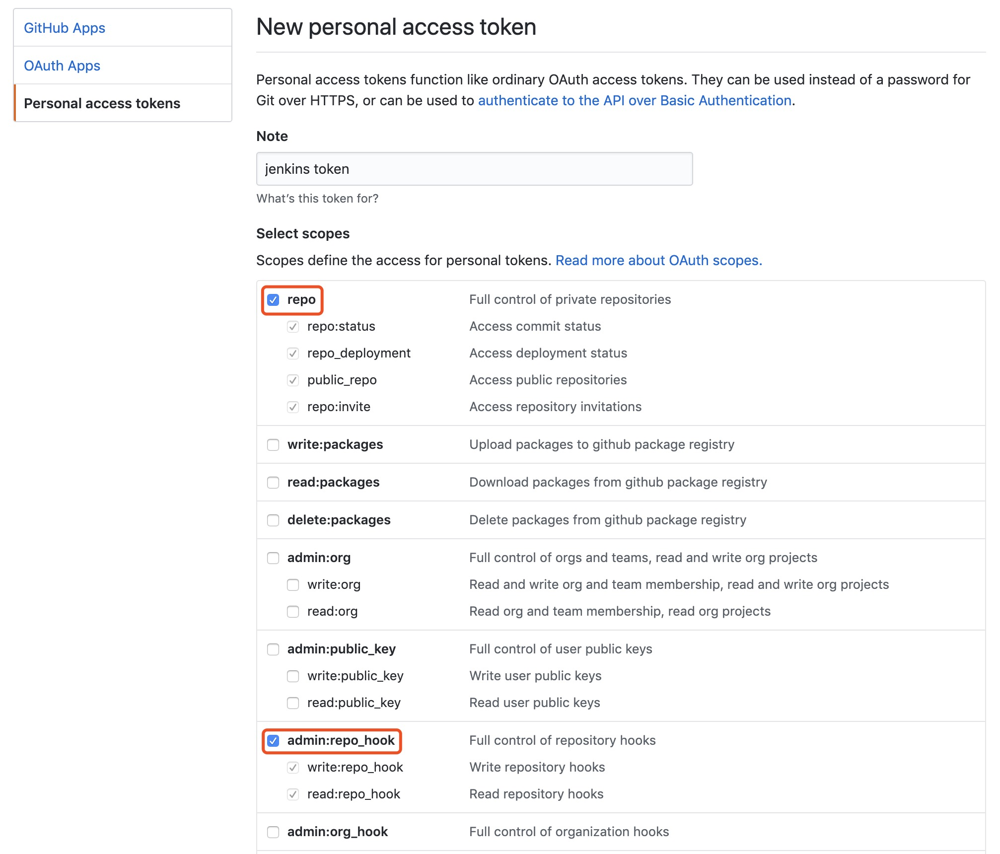
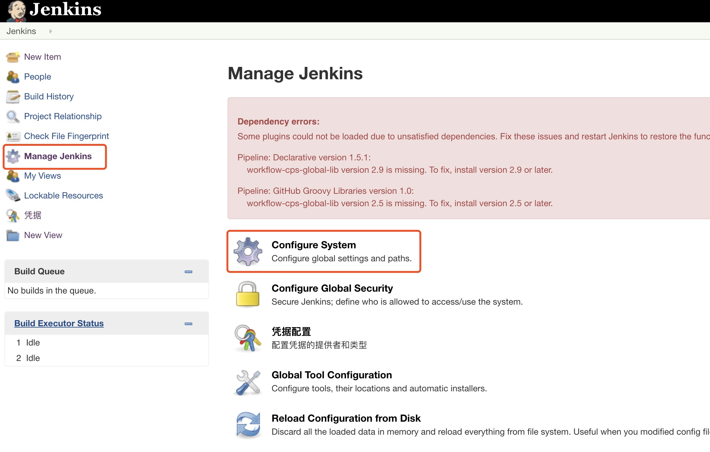
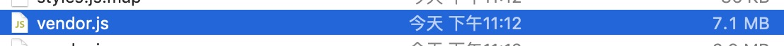
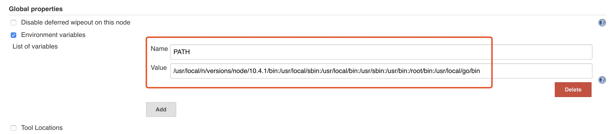

# SeedPortal

### Jenkins 辅助项目自动发布

#### 服务器安装Jenkins 和github 等相关插件
已完成

#### github 配置webhook 地址
进入要自动部署的github 项目下，点击Settings => Webhooks => add webhook



输入Payload URL，点击Add webhook，其中Payload URL的形式为 http://IP:PORT/github-webhook/


#### 在github 上生成Personal access tokens 用于授权jenkins 对github 进行的访问
点击头像下拉菜单中的Settings => Developer Settings => Personal access tokens



勾选repo 和admin:repo_hook



#### jenkins 添加token
在添加token 之前，首先要安装Github 插件，安装插件在插件管理中进行，安装好了之后点击管理Jenkins => 系统配置



#### 修改Jenkins 构建脚本
```
git pull
ng build --prod
cp -r dist/seedPortal /var/www/html/seedPortal
```


## Other Question?

### Why is vendor so large?


原始大小7.1M，开启gzip压缩之后变成1.3M，开启的方式是在nginx 中添加以下配置，添加位置与server 同级
```
gzip  on;
gzip_static on;
gzip_comp_level 2;
gzip_http_version 1.0;
gzip_proxied any;
gzip_min_length 1100;
gzip_buffers 16 8k;
gzip_types text/plain application/javascript application/x-javascript text/css application/xml text/javascript application/x-httpd-php image/jpeg image/gif image/png;
# Disable for IE < 6 because there are some known problems
gzip_disable "MSIE [1-6].(?!.*SV1)";
# Add a vary header for downstream proxies to avoid sending cached gzipped files to IE6
gzip_vary on;
```

### Jenkins npm command not found
```
echo $PATH
```


